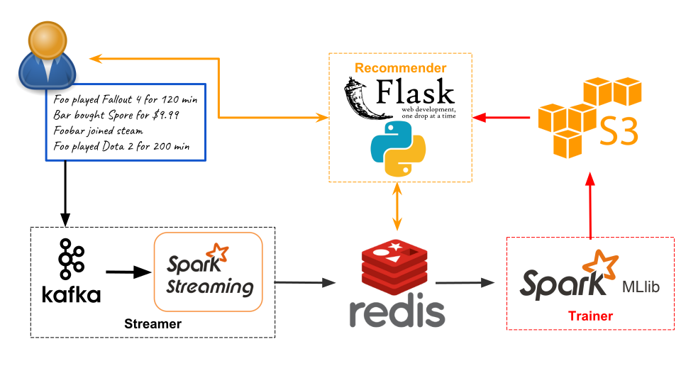

# NextGame
A data pipeline for realtime game recommendation

## Generator

The Generator component is used to generate new users and simulate user actions. The generated events will be sent to Kafka.

#### How the actions are generated?

First, random attributes were assigned to a user when she/he was created, including:

- `adventurousness`: how likely is the user willing to try new things
- `wealthiness`: how much is the user willing to pay for a game
- `activeness`: how 'active' the user is
- `genre_affinity`: how much the user like a specific genre of games (e.g. RPG, FPS, Sports, etc.)

Then, the Generator will fake actions based on the said attributes. For example, a RPG lover (a user with high RPG affinity) is more likely to buy/play Skyrim V, while a FPS fan more likely to pick CS:GO; a rich player thinks it is acceptable to pay $19.99 for a game, while a user with low `wealthiness` may be reluctant to do so.

## Streamer

The Streamer component is used to aggregated & reduced streaming data in small batches, throttle the writing frequency to database, reduce the round trip time and increase the overall throughput.

Currently, it's a two-node m4.large cluster, which is able to handle up to 10,000 events/sec.

## Trainer

The Trainer is used to train the Recommender model in batch. [Spark MLlib ALS  method for Collaborative Filtering](https://spark.apache.org/docs/2.2.1/mllib-collaborative-filtering.html) is used. Both explicit and implicit method were tested, and the former performs better. Ratings are converted from playtime, using the formula `rating = BASE_RATING + log10(playtime)`.

## Recommender

The recommender component combines the live streaming events and the batch trained model, recompute the user factor, and generate live recommendation that reflects the users' most recent activity.
